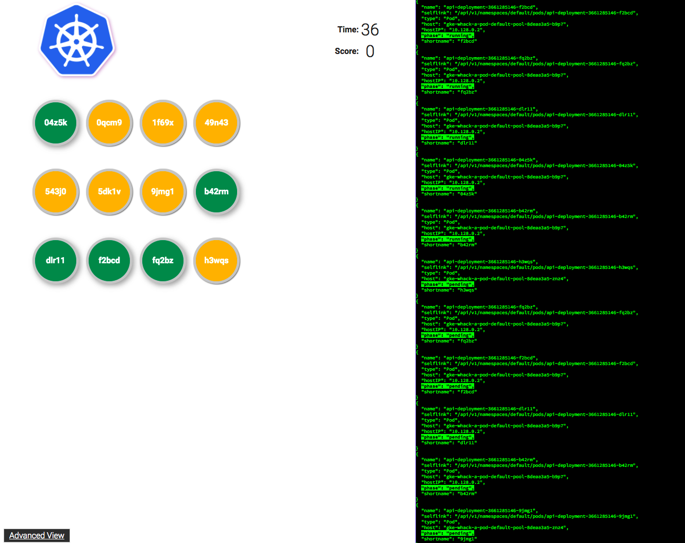
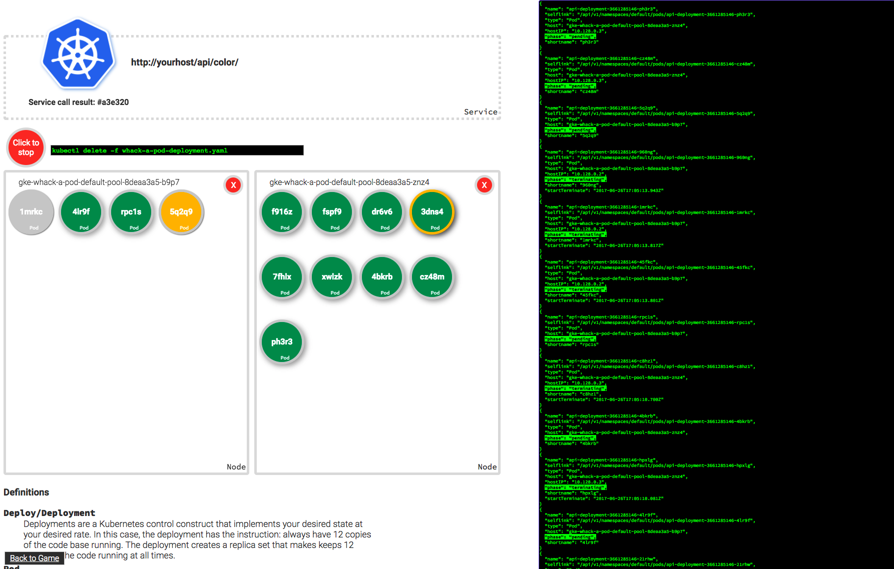

# Whack-a-pod
This is a demo that can be used to show how resilient services running on
Kubernetes can be. Main app shows a giant sign that flashes in various random
colors.  Those colors come a Kubernetes powered microservice.  If the service
goes down, the sign turns red. Your goal is to try and knock the service down
by killing the Kubernetes pods that run the service. You can do that by
whacking the pods wich are respresented as moles.

There is also a less busy verison of the game available at /next.html. This
version has an advanced mode that allows someone to do a more visual
explanation of the mechanics.

The advanced version allows you to track the pod that is serving the color
service and to simulate creating and destroying nodes.

## Getting Started

The current directions assume you are using Google Cloud Platform to take
advantage of Container Engine to build a manage your Kubernetes cluster.  There
is nothing preventing this app from *running* on a Kubernetes cluster hosted
elsewhere, but the directions for setup assume Container Engine. If there is
significant interest in these directions, I'll be happy to publish them (or
better yet, except a pull request.)

### Create and configure GCP project
1. Create Project in Cloud Console
1. Navigate to Compute Engine (to activate Compute Engine service)
1. Navigate to the API Library and activate Container Builder API

### Create Configs - Part 1
1. Make a copy of `/Samples.properties`, renamed to `/Makefile.properties`
1. Alter value for `PROJECT` to your project id
1. Alter `ZONE` and `REGION` if you want to run this demo in a particular area.
1. Alter `CLUSTER` if you want to call your cluster something other than
`whack-a-pod`.
1. Set `GAMEHOST`, `ADMINHOST`, and `APIHOST` if you have static host names for
your cluster.

### Build Infrastructure
1. Open a terminal in `/infrastructure/`.
1. Run `make build`.
`make build` will do the following:
    1. Create Kubernetes Cluster
    1. Create 3 static ip addresses for use in the app

>If you get the error `ResponseError: code=503,
message=Project projectname is not fully initialized with the default service
accounts. Please try again later.` You need to navigfate to Compute Engine in
Google Cloud console to activate Compute Engine service.

### Create Configs - Part 2
1. Open a terminal in `/`.
1. Run `make config` this will create all your kubernetes yaml files and a few
other things for you.
1. This should create the following files:
     1. /apps/admin/kubernetes/admin-deployment.yaml
     1. /apps/admin/kubernetes/admin-service.yaml
     1. /apps/game/containers/default/assets/js/config.js
     1. /apps/game/kubernetes/game-deployment.yaml
     1. /apps/game/kubernetes/game-service.yaml
     1. /apps/api/kubernetes/api-deployment.yaml
     1. /apps/api/kubernetes/api-service.yaml

### Build Application
1. Open a terminal in root of whack_a_pod location.
1. Run `make build`
1. Run `make deploy`
1. When process finishes Browse to the the value of `GAMEHOST`.

## Run demo
There are two skins to the game.
1. Carnival version:
    *  http://[gamehost]/
1. Google Cloud Next branded version:
    * http://[gamehost]/next.html
    * http://[gamehost]/advanced.html

The advanced version of the game is a great demo for teaching some of the
fundamentals of Kubernetes.  It allows you to cordon and uncordon nodes of the
Kubernetes cluster to simulate Node failure. In addition it shows which Pod of
the Replica Set is actually answering calls for the service.

### Clean Up
1. Open a terminal in `/`.
1. Run `make clean`
1. Open a terminal in `/infrastructure/`.
1. Run `make clean`

## Architecture
There are three Kubernetes services that make up the whole application:
1. Game
Game contains all of the front end clients for the game, both the carnival
version and the Google Cloud Next version.
1. Admin
Admin contains all of the logic for managing the whole application.  This is
the application the front end calls to get a list of the pods running the
color api, it also has calls to create and delete deployments, delete pods, and
drain and uncordon nodes.
1. Api
Api contains two service calls: color and color-complete. Color is a random
hexidecimal RGB color value. Color-complete is the same as color, but also
sends the pod name of the pod that answered the service call.

"This is not an official Google Project."